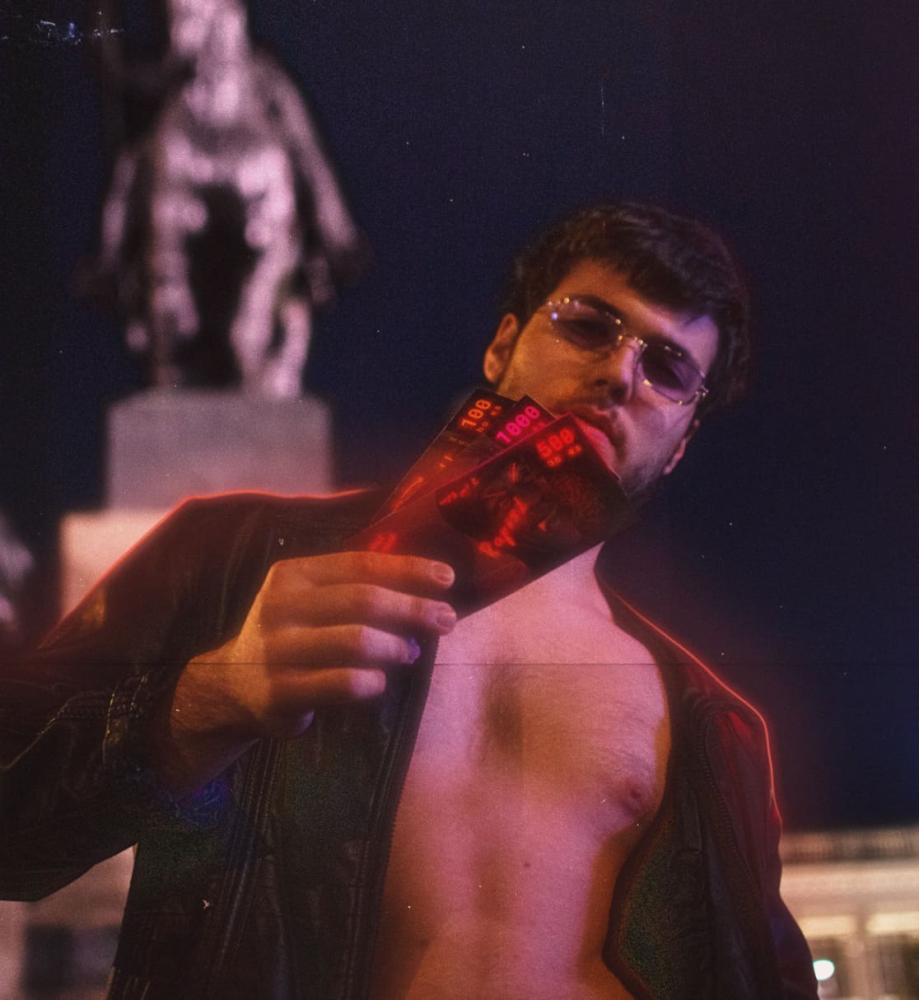
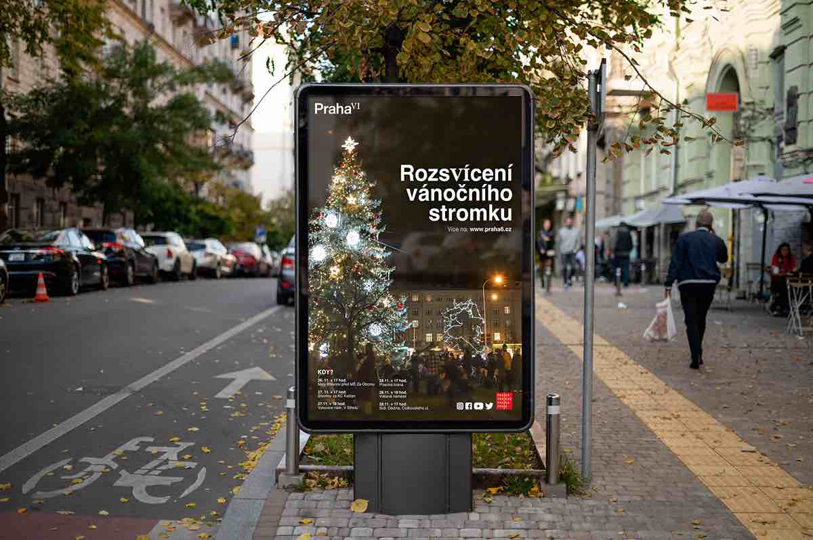
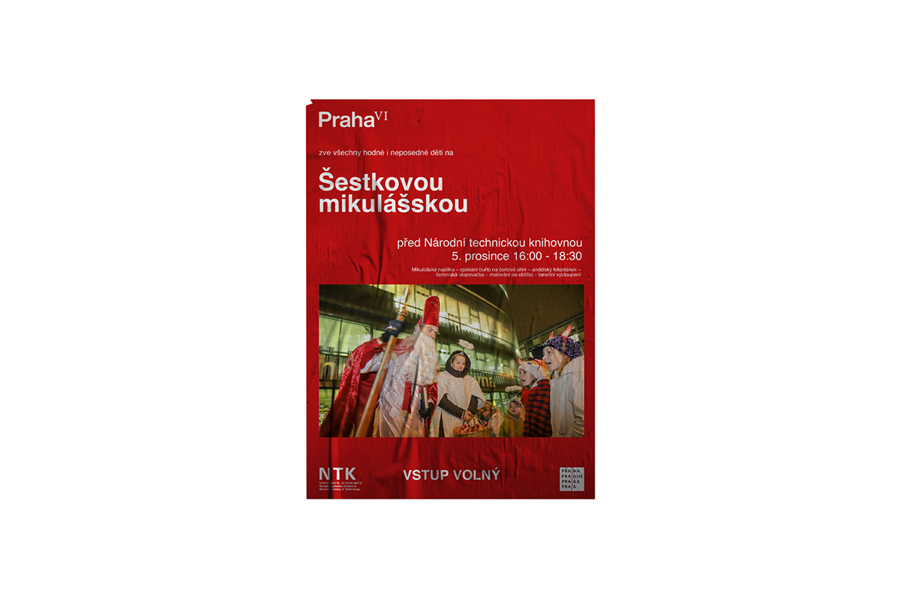
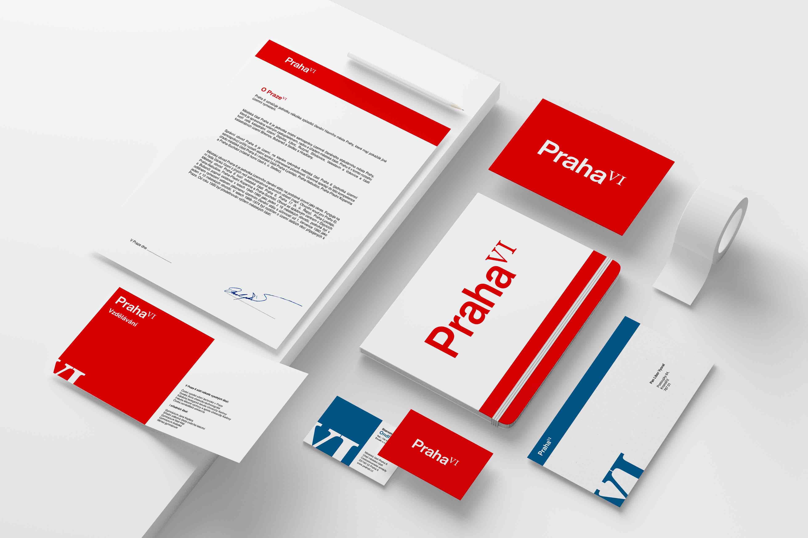
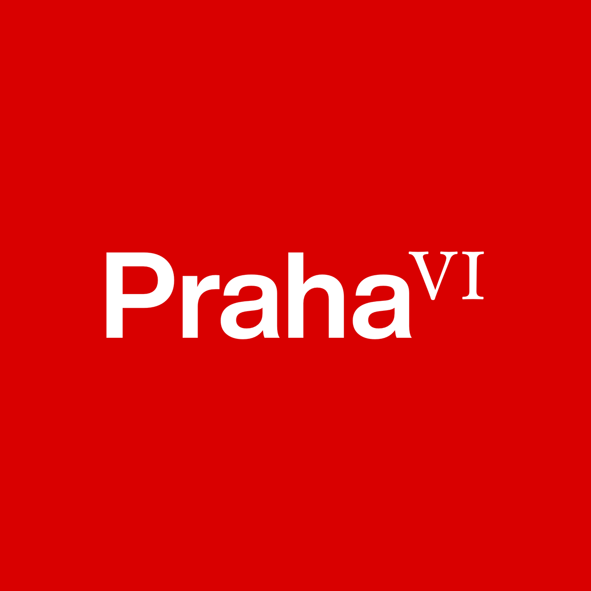

# First impression

## About me

Hello, 

I'm a graphic designer, originally from Olomouc, now living in Prague. I've been working as a freelancer since I was 18, but I'm also used to working in a team. I've already completed several successful projects, both school and personal.

After graduation, I decided to devote myself fully into graphic design. I began my studies at the College of Creative Communication, where I'm still studying. I always enjoy learning new things. So I follow trends in graphic design and read related books. All this helps me to improve. 

In my work I focus on logo design and brand identities. In my opinion, it is the most significant and most important part of graphic design. I try to be a problem-solver, always trying to get to know the customer and offer him the best possible solution. Thanks to this, I create a functional and long-lasting design.

## My work

### Identity for Praha IV

