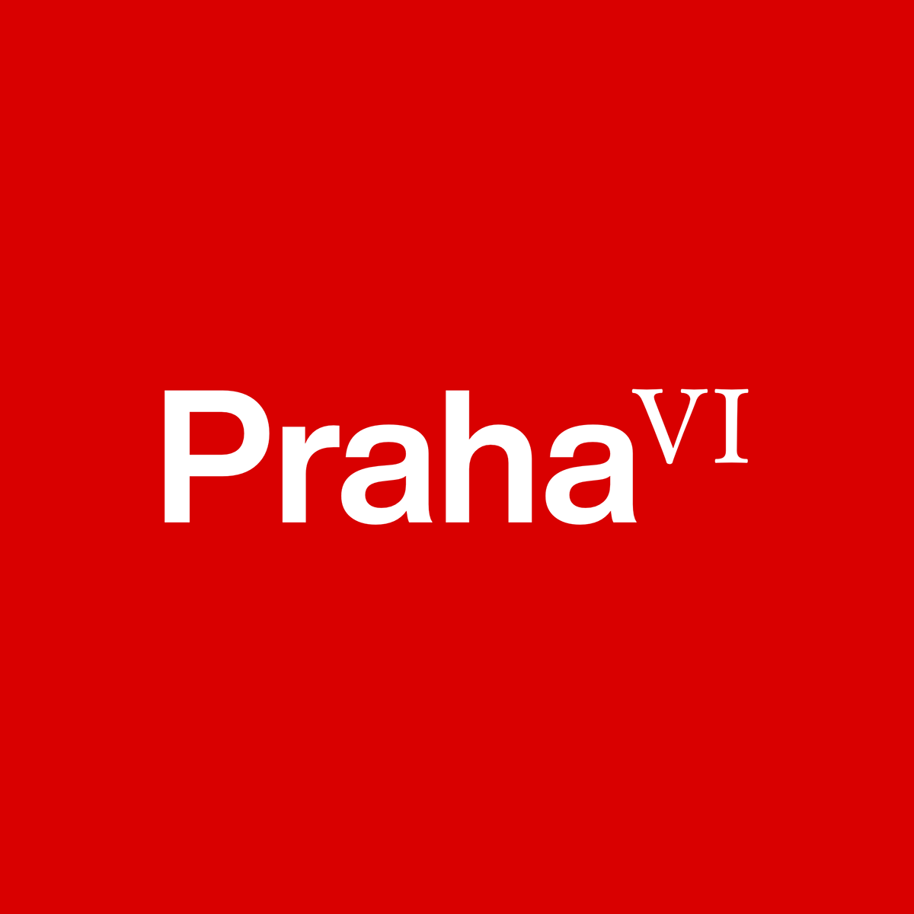
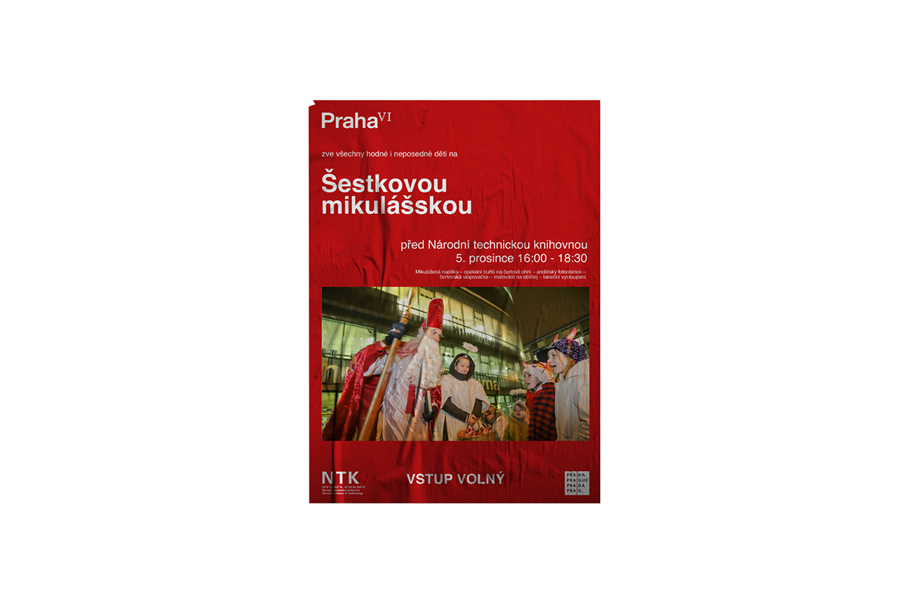
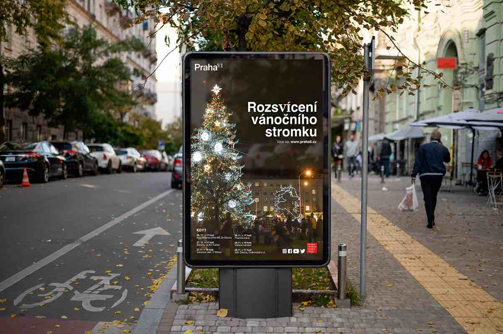
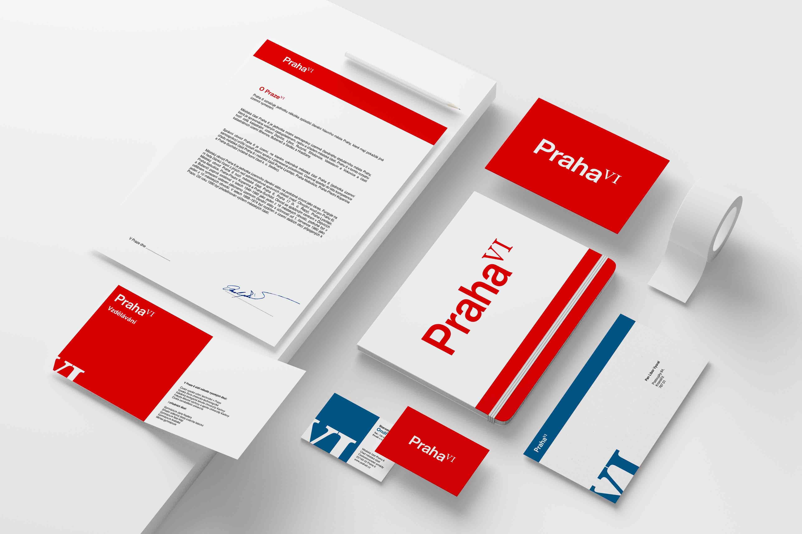

# Experience

## Praha IV

## About Praha 6

- The largest and most populated part
- Central point "Kulaťák"
- Lots of historic buildings and parks
- Seat of several universities, National Technical Library
- More than 40 embassies are located here
- Villa and luxury neighborhoods

## Logo

We finally found the required symbol in a combination of sans serif typography for the name of the capital (Helvetica Now Display) and the Roman numeral VI (Baskerville Ten). The symbol represents historicity, international relations and a very decent standard of living in this part of the city.

## Application

The communication potential is further developed thanks to the character of the numbers, which can also function as text and can therefore be substituted for the syllables -vi- in the text (Břevnovské vinobraní; Rozsvícení vánočního stromku; informační grafika Víte, že na Praze Vi)

