# Infographics can save your life

My [process](Progress/index.md)

## 1.3.2020
It all started on March 1, 2020, when Covid 19 first appeared in the Czech Republic. The news was flooded with infographics and all sorts of charts. That's when I realized that communicating complex information in a clear and simple way is not easy. 

So I decided to try it out on my own project. I tried to make an infographic about the war in Ukraine and communicate military facts. It really is harder than it looks!

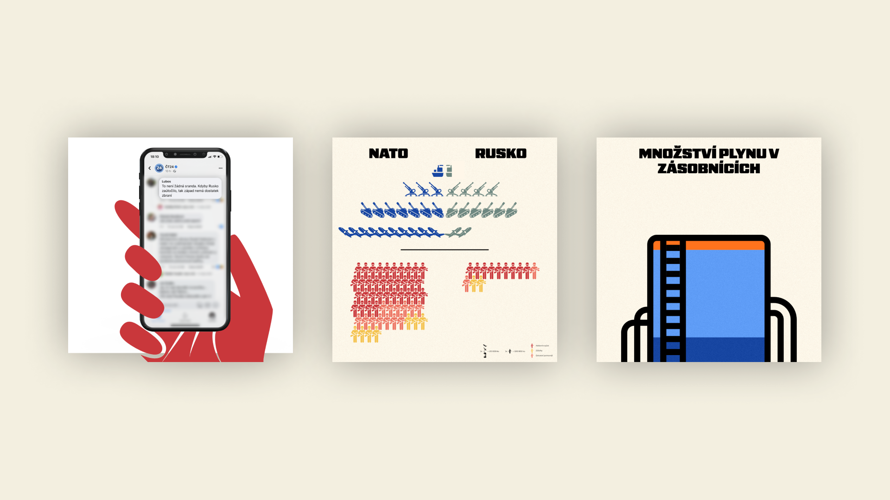

## So what is an infographic?
"Representation of information in a graphic format designed to make the data easily understandable"
In my own words, I would say it's a way of converting information and text into an image to preserve its own meaning.

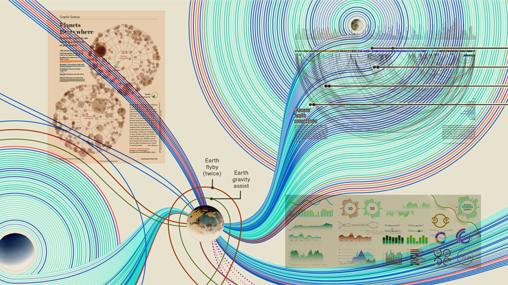

## Let's give some examples
The following information that there are 15 students in this class and 6 students in the next class can be presented in several ways.

## History of infographics
It may surprise you, but I think the first infographics started appearing in cave paintings. These paintings are surprisingly anatomically accurate and often show how animals are hunted and what their insides look like.

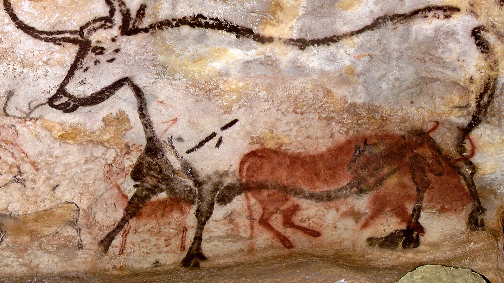

Continuing on to Egypt, their writing consists of pictures, so again, pictures communicate stories.

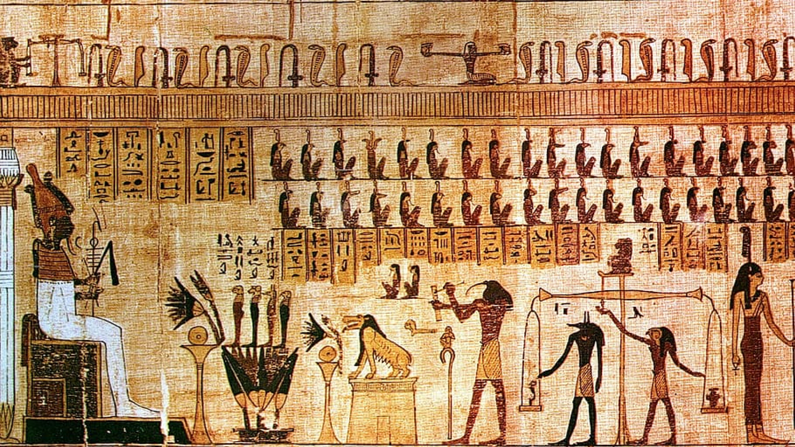

During the Middle Ages, they again painted detailed maps showing land, buildings and rivers. Similarly, Leonardo da Vinci had already made several plans of war machines, showing exactly how they worked.

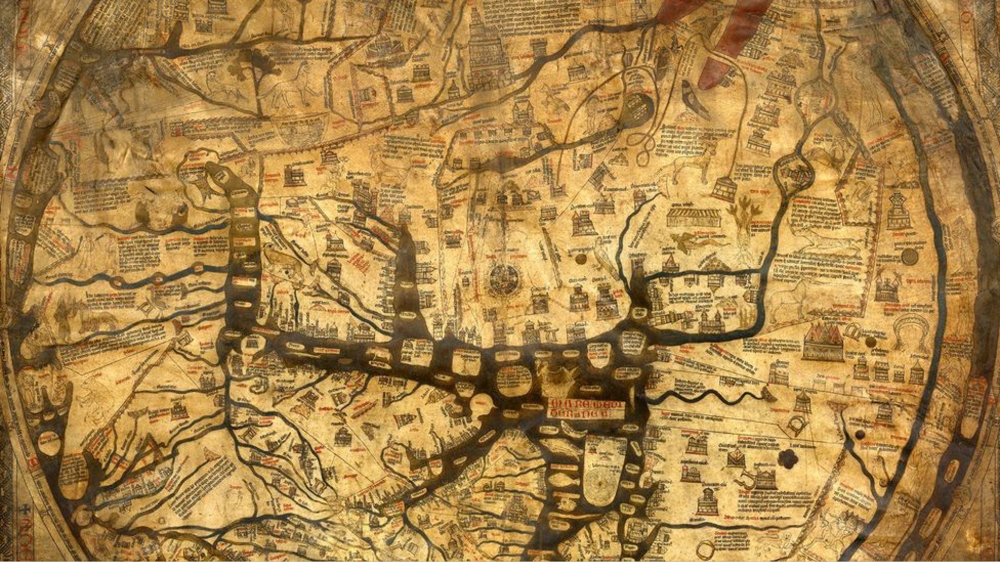

However, the biggest boom in infographics came during the Second World War.

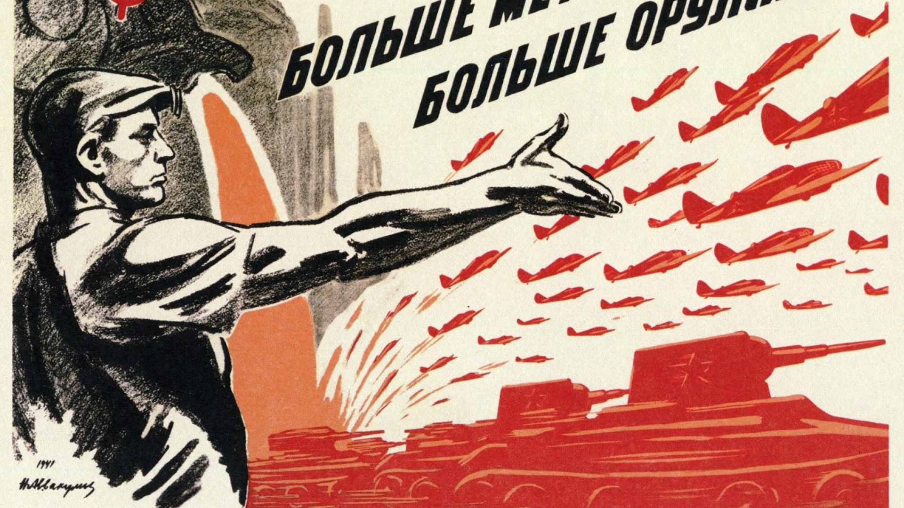

## So what can infographics show?

Location

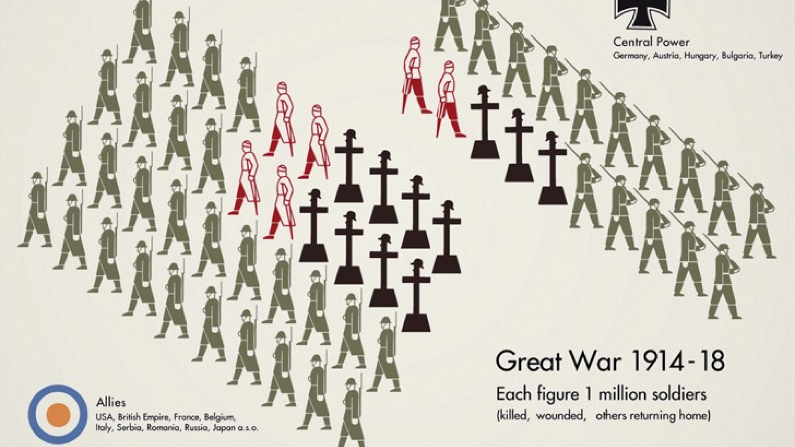

Time

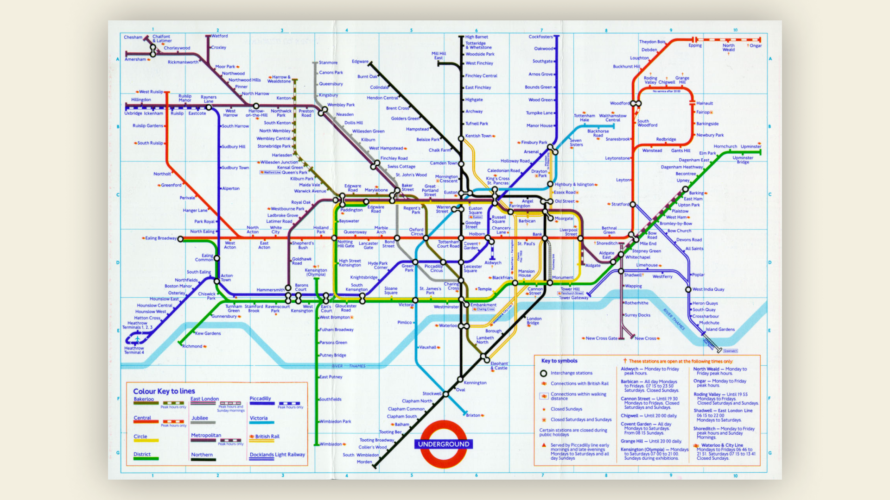

Category

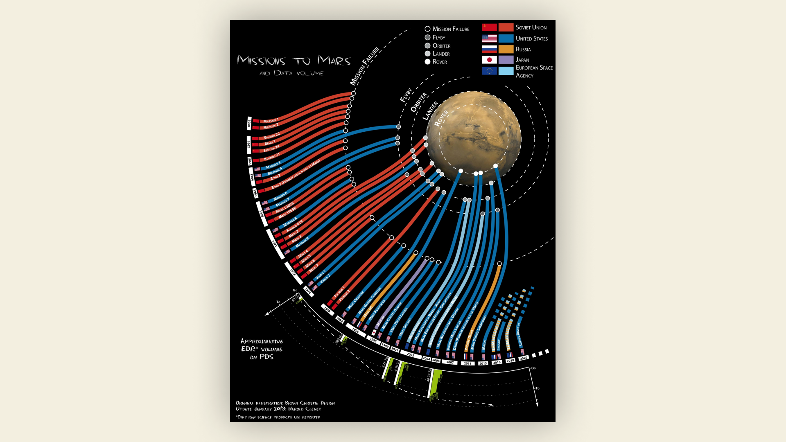

Hierarchy

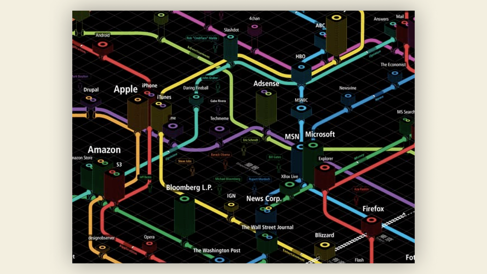

## 3 rules of infographics

1. Consistency

2. Less is more

3. Deciding what's most important

## How not to make an infographic

A clear hierarchy is extremely important because it guides people and if it's not clear it fundamentally affects the whole.

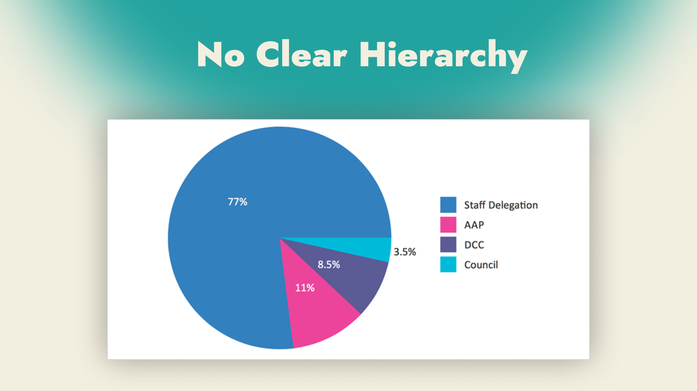

Unclear process

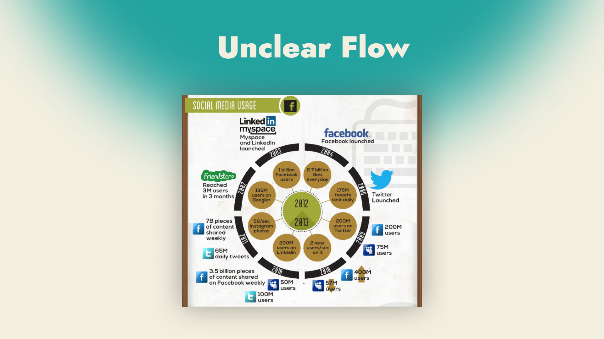

Too much information just overwhelms the audience

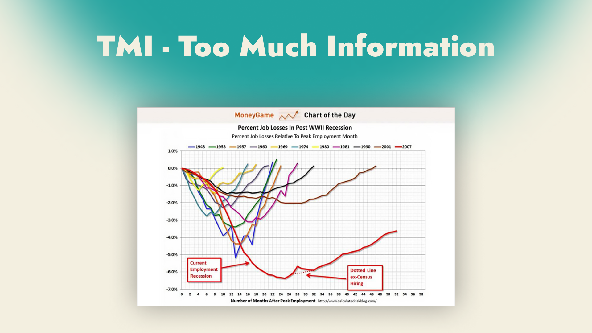

## When infographics can save your life

Danger Level 1

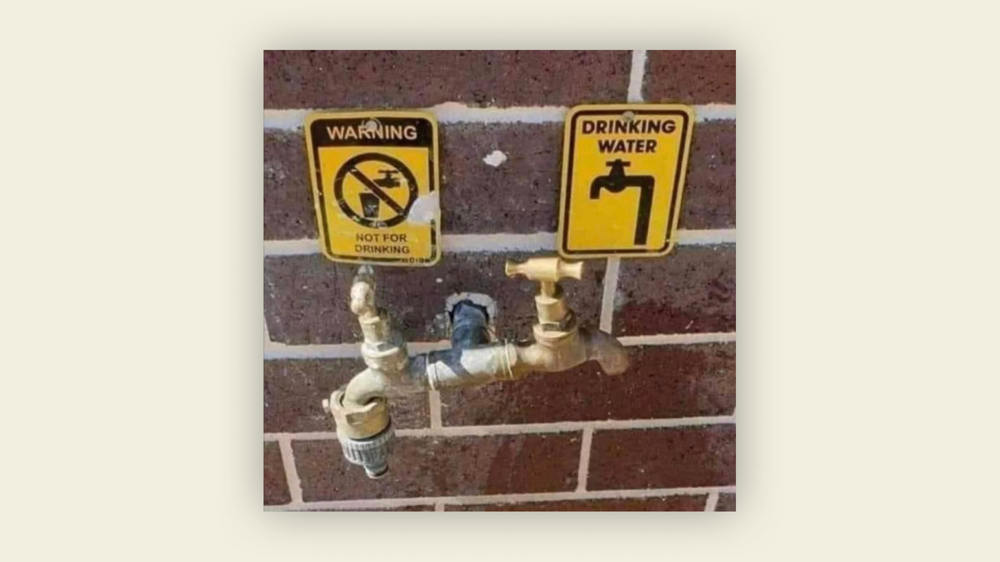

Danger Level 2

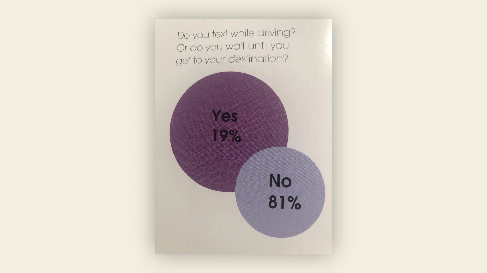

Danger Level 3

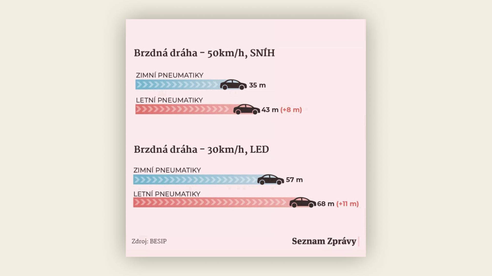

That's all, thanks for your attention.
