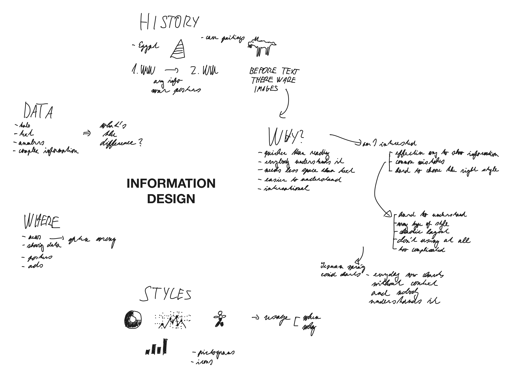
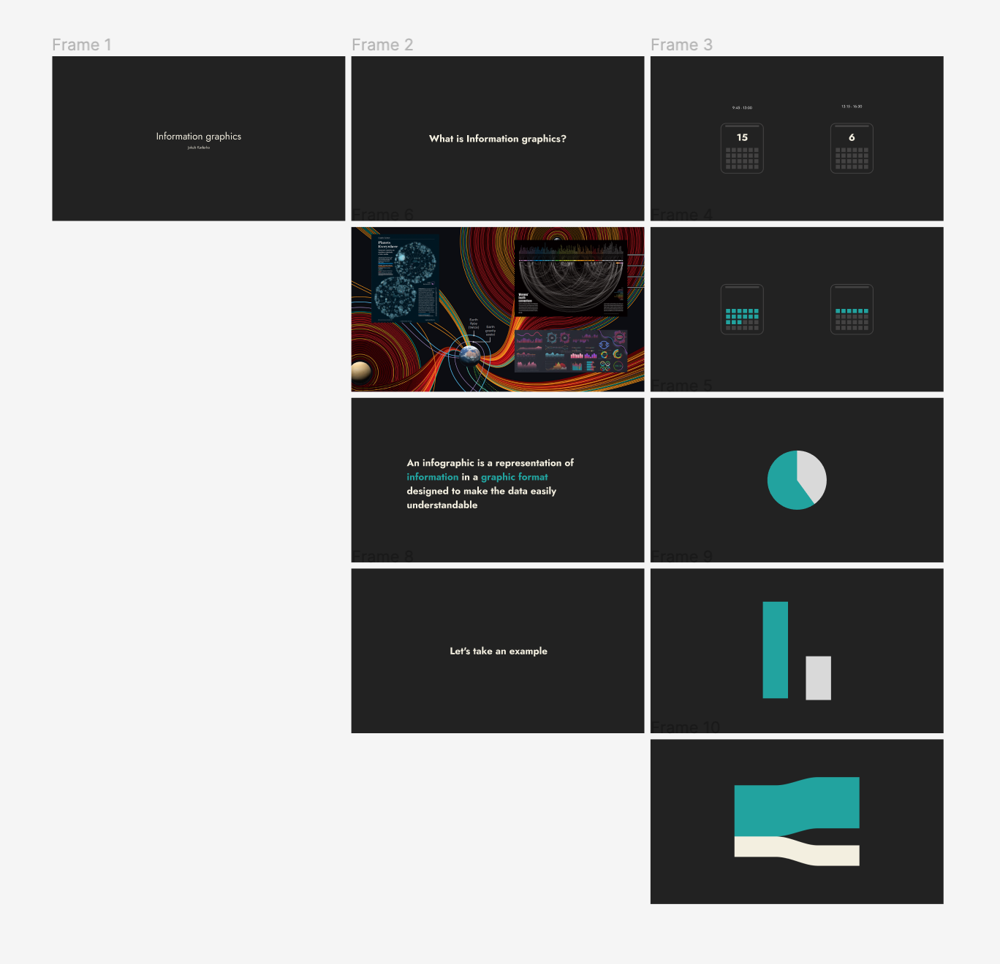

# Infographic can save your life

by Jakub Kaderka

## Brainstorm

At first I started with some brainstorming.

## About, heading

Than I wanted to think about I can write about and choose some heading.

**Infographic can save your life**

This heading can grab attention and at the same time show the importance of good infographic.

### content

- Why I love Infographic

Covid -> today

Looks easy, but making it is really hard

- What is infographic

Examples, real world cases

- History

When it all started, big boom during WW

- importance of infographic

Why it is important, examples when infographic can save lives

- Common mistakes

Mistakes I found in mainstream press

- End

conclusion and some tips 

## Slides

Next I wanted to outline some slides and think how they can look.

