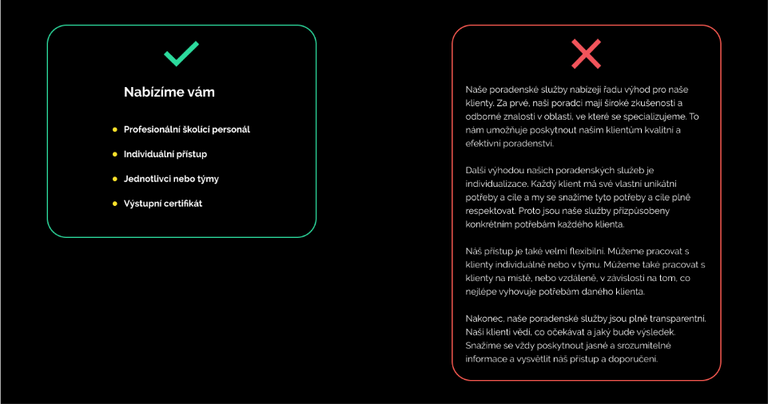

# My thesis presentation

Full [video](https://youtu.be/W8vp__yx2hM)

Short sumup

Initially, the work was to be purely about a graphic manual for one particular company that had changed its business area and therefore needed a new identity. The manual was originally to contain only logos, prohibited and permitted variants, colors and fonts and other typical content of a graphic manual. The company I was originally to create the manual for was called J.P.O.S.K invest and was in the investment and advisory services business. However, it has recently started buying up companies of various kinds from its accumulated capital and has thus become a holding company, itself then being the parent company. After a while, there was a major problem, each firm had a different quality of performance. Just as the quality of logos differed, so did the approach to communication. Most only had a website, which was the only place of self-presentation.

Before I set to work, I first decided to map the current performance of the companies. The individual companies had no unifying element or common system. There was no reason for it; until then, each of the companies had played for itself and operated completely independently. After the subsequent acquisition, the owner was no longer satisfied with this situation and wanted the companies to start working together. The scope of the work itself was not precisely defined, but from his point of view he wanted all the brands to belong visually to the same family but still retain their originality. Another requirement was to make the whole process of creating graphics more efficient and make sense in the context of the whole family. 

The logos come in a variety of shapes and colours. But in many cases they share fundamental typographical errors. The type composition in the logo uses too thin cuts of type. This causes poor legibility and recognition of the logo. Another problem is in the colours, where either the shade is so light that it fades on a white background, or colours are used that are too similar. 

Most companies' websites contain only a landing page, and in a few cases a small number of subpages or sections. The fact that in most cases only one-page sites are sufficient is a huge advantage. If necessary, this makes it possible to quickly and efficiently generate new websites that will not need much maintenance in the future. However, existing websites have a big problem in contrast and readability. Due to the fundamental overuse of contrasting colours and the lack of space between elements, it is sometimes difficult to navigate the content and text.

The new logos are based on a simple system. Each time, it starts on a 15x15 grid and the three most basic shapes, namely square, triangle and circle, are composed on it. The resulting logo is then composed of these specially placed shapes. This process will ensure that there is consistency between the logos, as none will be able to stand out from the others in any significant way. Moreover, all of them will be slightly similar and it will be easy to tell at a glance that they are one family of brands. However, it will still be possible to create original logos, as the system is open enough to allow for the creative treatment of symbols.

I designed a set of colours for the whole holding that are written across all the projects. These colours are black, white, light blue and light grey. They are used for example for text, background or highlights. As far as the individual companies are concerned, the colour system is always divided into primary and secondary colours. Each business area in which the companies operate has a defined primary colour. These were chosen based on the rules of colour harmony combined with their psychological impact. They are mainly used for logos and the most important elements. The secondary system is then derived from the primary colour according to the triangular colour combination. Colours from the secondary system are very contrasting to the primary colour and are used for illustrations or highlights, for example.

Just as the owner is young and progressive, he carries these qualities over to all of his businesses. He tries to find new ways to make things easier for customers, offers extra services and makes sure everything is based in the Czech Republic. It is constantly pushing things forward and pushing for innovation in all directions. However, sometimes he got carried away and the communication was too complicated and hard for ordinary people to understand. He also often prioritized development and moving forward over quality testing and graphics. At times, therefore, the companies' actions seemed amateurish and unprofessional. Therefore, I decided to capitalize on these facts and draw conclusions from them to determine the communication style of the whole holding. 

In the spirit of making things easier, communication should above all be simple and to the point. Certainly not to try to delay anyone unnecessarily or to promise the impossible. Authenticity is also important. There is no need to play big corporations; it can be clear that these are small entities based in the Czech Republic. All conversation between customers and the holding company should be respectful, which is why customers are told off. However, in order to maintain a youthful spirit, first names of customers may be used in certain situations. For example, after logging into the personal administration or in the newsletter. 

In terms of form, again there is a strong emphasis on readability and simplicity. There is no need to explain the services in a complicated way, but to explain the advantages and disadvantages clearly and understandably. Similarly, lengthy texts are not desirable. The text should be handled very carefully and avoid padding and artificial stretching. Paragraphs are an integral part of the text and are used to communicate facts and facts quickly and easily.

And thats it, Thanks!
