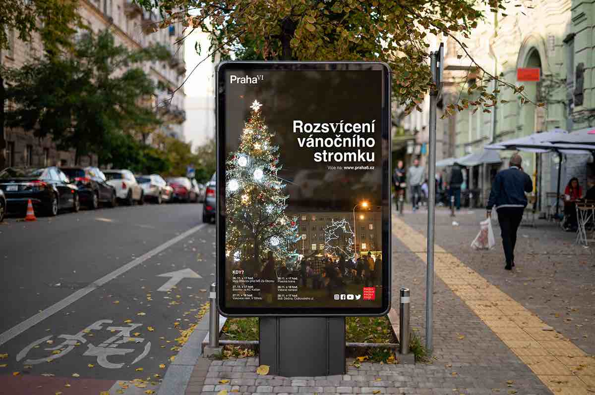

# Hello, I'm Kuba

This is my homepage

[And this is my website full of juicy content](https://kaderkae.myportfolio.com)

## About

- Something about me
- [My CV]()

## Case study

# Praha VI

Praha 6    Case Study

**Cooperation:** Petr Kulhánek

**Project:** The District of Prague 6 announced an open competition for a new visual identity to unify and systematize visual communication, including selected companies

**Goal:** Create a visual style that will not be just a logo, but a logical and complex system forming a unified visual identity of Prague 6

### About Praha 6
- The largest and most populated part
- Central point "Kulaťák"
- Lots of historic buildings and parks
- Seat of several universities, National Technical Library
- More than 40 embassies are located here
- Villa and luxury neighborhoods

### Key words

### How we worked
Research -> brainstorm -> sketches -> refinement -> application

### Sketches
The biggest challenge was to create such a symbol that would combine individuality, pride, and tradition. We decided to work only with the name "Prague 6", exploring several ways of how the symbol would look like

 

Thanks to sketching, we realized that we needed to add a new dimension to the design and focus more on the unmistakability of the symbol itself.

### Refinement
We finally found the required symbol in a combination of sans serif typography for the name of the capital (Helvetica Now Display) and the Roman numeral VI (Baskerville Ten). The symbol represents historicity, international relations and a very decent standard of living in this part of the city.

 

The logotype thus combines both the rich history of Prague 6 dating back to the 6th century and the modernity of the world metropolis. The number VI also refers to the already mentioned diplomacy and law, in whose writings and norms these ancient numbers are found.

 

### Application
The communication potential is further developed thanks to the character of the numbers, which can also function as text and can therefore be substituted for the syllables -vi- in the text (Břevnovské vinobraní; Rozsvícení vánočního stromku; informační grafika Víte, že na Praze Vi)

 
 

### The result of the project
We managed to develop a unique branding for Prague VI, which shifts from current trends in visual identity design, but at the same time looks timeless and would last this proud part of the city for many years.

`hello`

## Class work

- [Alternative text](01-alternative-text/index.md)
- [First impression](02-first-impression/index.md)
- [Content first](03-content-first)
- [Experience](04-experience)
- [Voice and tone](05-voice-tone)
- [Takeways](takeways/index.md)
